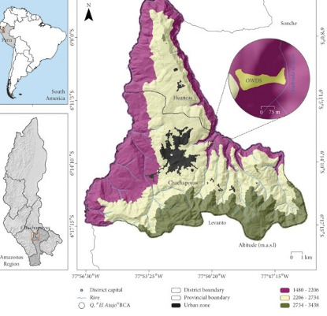

# **Título**

Respuestas morfológicas y fisiológicas del etileno y nitrato de plata en el pepinillo  (*Cucumis sativus* L.)

# **Planteamiento del problema**

La hormona vegetal, etileno, tiene efectos fisiológicos sobre las plantas como expansión celular, quiebre de dormancia en semillas, inducción de floración, maduración de frutos, aceleración de la senescencia y caída de hojas y de flores. Entre sus usos comerciales y aplicaciones más comunes tenemos maduración de frutos y regulación de floración como en algunos cultivos que presentan flores femeninas y masculinas, el etileno afecta la diferenciación floral y gatilla la formación de flores femeninas. Con ello el número de plantas productivas y el rendimiento por hectárea aumenta. Tradicionalmente este efecto es conocido en algunas Cucurbitáceas. (Jordan & Casaretto, 2006). En el cultivo del pepinillo  (Cucumis sativus L.), esta hormona es útil para incrementar el número de flores femeninas en cultivares monoicos, lo que favorece la producción de frutos con semillas.

Por otro lado, el nitrato de plata (AgNO₃) se le conoce por inhibir la acción del etileno.  (Kumar, V. et al). El nitrato de plata bloquea la acción del etileno, promoviendo la formación de flores masculinas. Entonces en aplicación conjunta pueden ser usados para el mejoramiento genético y la producción de semillas híbridas. Se puede aplicar etileno para aumentar flores femeninas en la línea hembra. Y nitrato de plata para inducir flores masculinas en líneas feminizadas, asegurando polinización controlada.

Frente a esto, surge la necesidad de realizar un estudio experimental que permita observar de forma controlada y medible cómo responden las plantas de pepinillo, tanto a nivel morfológico (altura, número de hojas, número de flores y frutos) como fisiológico (contenido de clorofila, tasa de transpiración, etc.), cuando se aplican distintas concentraciones de etileno y nitrato de plata.

¿Cuáles serán las respuestas morfológicas y fisiológicas del etileno y nitrato de plata en el pepinillo ?

# **Objetivos**

##  **Objetivo general**

- Determinar las respuestas morfológicas y fisiológicas del etileno y nitrato de plata en el pepinillo.

## **Objetivos específicos**

- Evaluar los efectos de distintas concentraciones de etileno en las variables morfológicas del pepinillo

- Evaluar los efectos de distintas concentraciones de nitrato de plata (AgNO₃) en las variables morfológicas del pepinillo.

- Determinar las variaciones fisiológicas en el pepinillo tratadas con etileno y nitrato de plata.

- Comparar las respuestas morfológicas y fisiológicas del pepinillo tratadas con etileno frente a las tratadas con nitrato de plata.

- Identificar la concentración óptima de etileno y nitrato de plata que promueva el mejor desarrollo morfológico y fisiológico en el cultivo de pepinillo.

# **Antecedentes de la investigación**

En los últimos años, se ha intensificado la investigación sobre compuestos    reguladores del crecimiento vegetal, especialmente el etileno y los inhibidores de su acción como el nitrato de plata, por su influencia directa sobre la morfología y fisiología de cultivos hortícolas. En el caso del pepino (Cucumis sativus L.), estos compuestos han sido utilizados para modular la floración y la diferenciación sexual, generando importantes implicancias agronómicas.

La literatura global respalda el uso de etileno para promover flores femeninas y de AgNO₃ para inducir flores masculinas en pepino, con aplicaciones exitosas tanto en campo como en invernadero. No obstante, predominan estudios in vitro o en otras regiones. Falta investigación que aborde respuestas fisiológicas integrales (contenido de clorofila, fotosíntesis, rendimiento reproductivo) en condiciones agronómicas peruanas.

La presente tesis busca llenar este vacío, evaluando respuestas morfológicas y fisiológicas mediadas por etileno y nitrato de plata en C. sativus L., proporcionando datos aplicables a la agricultura regional.

En América Latina, incluyendo Perú, hay escasas aplicaciones de AgNO₃ en campo para pepino. La mayor parte de la literatura se limita a entornos controlados o in vitro, con pocas investigaciones en condiciones locales. Esto representa una oportunidad para evaluar las respuestas morfofisiológicas, desde fotosíntesis hasta producción de flores, en contextos agroclimáticos reales. Sí hay investigaciones en condiciones agrícolas, pero con escasa aplicación de etileno/plata en C. sativus. El único estudio latinoamericano de crecimiento con reguladores en pepino fue el de Gosai et al. (2020) publicaron una revisión sobre reguladores del crecimiento en Cucumis sativus L., enfatizando que el ethephon a 300–400 ppm ralentiza el crecimiento secundario e incrementa la femineidad, y que la aplicación de silver nitrate (AgNO₃) a 400 ppm promueve la producción de flores masculinas.

Por otro lado, en el contexto internacional tenemos varias investigaciones, que se interesan por el tema en mención, con diferentes aplicaciones.

Karakaya y Padem (2011) estudiaron C. sativus en invernadero bajo dos variedades (‘Mostar F1’ y ‘Beith Alpha F1’), aplicando AgNO₃ en dosis de 0, 250, 500, 750 y 1000 ppm. Hallaron que dosis de ≥250 ppm generaron flores masculinas prácticamente ausentes en los controles, con aumento proporcional a la concentración y disminución de flores femeninas.

En cónsono, A. den Nijs y Visser (1980) reportaron que una sola aplicación de AgNO₃ (500 ppm) induce numerosas flores masculinas en líneas ginecéicas bajo invernadero. También, Stankovic y Prodanovic (2002) observaron que dosis entre 0.01–0.04 % aumentan significativamente las flores macho y reducen las femeninas en dos ciclos de siembra.

Un estudio de 2023 sobre la densidad de tricomas demostró que la aplicación foliar combinada de AgNO₃ y tiosulfato de plata incrementa la densidad de tricomas, afectando expresiones morfológicas y transcriptómicas en frutos jóvenes (Vu et al., 2023) .

En 2021, se confirmó que la aplicación de AgNO₃ al 400 ppm aumenta la proporción de flores masculinas (Khanal, 2020; FAO, 2024).

La literatura global respalda el uso de etileno para promover flores femeninas y de AgNO₃ para inducir flores masculinas en pepino, con aplicaciones exitosas tanto en campo como en invernadero. No obstante, predominan estudios in vitro o en otras regiones. Falta investigación que aborde respuestas fisiológicas integrales (contenido de clorofila, fotosíntesis, rendimiento reproductivo) en nuestro contexto nacional.

# **Hipótesis**

La aplicación de etileno y nitrato de plata influye significativamente en la expresión morfológica y fisiológica del pepinillo (*Cucumis sativus* L.), modulando la proporción de flores femeninas y masculinas.

# **Metodología**

## **Área de estudio **

El presente trabajo de investigación se llevará a cabo en un área de vivero perteneciente a la universidad nacional Toribio Rodriguez de Mendoza, en la provincia de Chachapoyas, región Amazonas, Perú. Chachapoyas se encuentra en coordenadas geográficas 6°13′54.1″ S, 77°52′8.5″ O, con altitud aproximada de 2 335 m s. n. m. (Geodatos, 2025).

Nota. *Tomado de Analytic Hierarchy Process (AHP) for a landfill site selection in Chachapoyas and Huancas (NW Peru): Modeling in a GIS-RS environment, por A. Inga-Fernández y K. Inga-Rosales, 2021, Revista de Investigación de la FIGMMG, 24(49).*

## **Población, muestra y muestreo**

### **Población**

La población estará constituida por plantas del cultivar INIA 560 – Blanco Urubamba de Cucumis sativus L., variedad comúnmente utilizada en la región.

### **Muestra**

La muestra estará conformada por 40 plantas distribuidas en dos experimentos independientes, correspondientes a los tratamientos con etileno (ethephon) y nitrato de plata, respectivamente.

### **Muestreo**

Se empleará un muestreo aleatorio simple, donde cada unidad experimental (planta dentro de cada tratamiento) tendrá la misma probabilidad de ser seleccionada para la evaluación. Esto garantiza la objetividad de los datos y permite aplicar análisis estadísticos válidos, acordes con el diseño completamente al azar (DCA) utilizado en los experimentos.

## **Variables de estudio**

### **Variables independientes**

- Dosis de etileno
- Dosis de nitrato de plata

### **Variables dependientes**

Parámetros morfológicas

- Altura de planta

- Número de hojas

- Número de flores masculinas

- Número de flores femeninas

- Número de frutos cuajados

Parámetros fisiológicos

-Fotosíntesis neta

- Conductancia estomática

- Tasa de transpiración

- Eficiencia del uso del agua

- Fluorescencia de la clorofila a

- Contenido de clorofila a

- Contenido de clorofila b

- Contenido de carotenoides totales

Indicadores de rendimiento

- Número de frutos por planta

- Longitud de fruto

- Peso de fruto

- Peso de frutos por planta

## **Métodos**

### **Diseño de la investigación**

Se instalarán dos experimentos, bajo un diseño completamente al azar (DCA), cada experimento estará conformado por cuatro tratamientos con cinco repeticiones, con un total de 20 unidades experimentales.

Tabla 1. *Tratamientos del experimento 1.*

| Tratamientos | Descripción              |
|--------------|---------------------------|
| T1           | Control                   |
| T2           | Etephon (dosis baja)      |
| T3           | Etephon (dosis comercial) |
| T4           | Etephon (dosis alta)      |

Tabla 2. *Tratamientos del experimento 2.*

| Tratamientos | Descripción                     |
|--------------|----------------------------------|
| T1           | Control                          |
| T2           | Nitrato de plata (dosis baja)    |
| T3           | Nitrato de plata (dosis media)   |
| T4           | Nitrato de plata (dosis alta)    |

### **Distribución de los tratamientos**

Se instalarán dos experimentos bajo un diseño completamente al azar (DCA). Cada experimento estará compuesto por cuatro tratamientos y cinco repeticiones, sumando un total de 20 unidades experimentales por experimento. El área tendrá una medida de 10 metros cuadrados.

Cada unidad experimental estará representada por una maceta, adecuadamente numerada y distribuida al azar en el área experimental.
La maceta tendrá 30 cm de diámetro y de 25 a 30 cm de profundidad, 10 cm entre macetas y  30 cm entre filas si hay varias. 

- Cada maceta ocuparía un espacio efectivo de 40 cm × 40 cm

- 0.16 m² por planta

- En 40 macetas  se ocupará  6.4 m²

### **Características del campo experimental**

El experimento se llevará a cabo en macetas de 30 cm de diámetro y de 25 a 30 cm de profundidad, colocadas en un área total aproximada de 10m². Las macetas se dispondrán con suficiente espaciamiento (30 cm entre filas y 1o cm entre macetas) para evitar competencia entre unidades y permitir un manejo adecuado del cultivo.

Tablas 3.

::: {.center}
| Elementos                         | Cantidad / Valor | Unidad / Detalle                     |
|----------------------------------|------------------|--------------------------------------|
| Número total de macetas          | 40               | unidades                             |
| Diámetro de cada maceta          | 30               | cm                                   |
| Espacio entre macetas (horizontal)| 10               | cm (de borde a borde)                |
| Espacio entre filas (vertical)   | 30               | cm (entre centros de macetas)        |
| Ancho total del campo            | 320              | cm (3.2 metros aprox.)               |
| Largo total del campo            | 300              | cm (3.0 metros)                      |
| Área total utilizada             | 9.6              | m²                                   |
| Área disponible                  | 10               | m²                                   |
| Distribución recomendada         | 5 filas y 8 columnas | Rectangular                        |
:::

### **Análisis de suelo**

Se recolectarán muestras compuestas del sustrato o suelo que será utilizado en las macetas, a fin de caracterizar sus propiedades físico-químicas: pH, materia orgánica, textura, fósforo disponible, nitrógeno total, potasio intercambiable y capacidad de intercambio catiónico (CIC). Estas muestras se enviarán a un laboratorio especializado.

### **Preparación del terreno**

El suelo recolectado será tamizado y homogeneizado. Se desinfectará mediante solarización o tratamiento térmico si fuera necesario, para evitar contaminaciones por plagas o patógenos. Luego, se llenarán las macetas de manera uniforme.

### **Siembra**

La siembra se realizará directamente en las macetas utilizando semillas de la variedad INIA 560 – Blanco Urubamba, previamente desinfectadas con hipoclorito de sodio al 1%. Se colocarán dos semillas por maceta, y tras la germinación se realizará un aclareo dejando la plántula más vigorosa.

### **Fertilización**

Se aplicarán dos fertilizaciones: una al momento del establecimiento y otra durante la floración. La dosis será homogénea en todas las macetas, ajustada con base en el análisis de suelo, utilizando fertilizantes como urea, fosfato diamónico (DAP) y sulfato de potasio, disueltos en agua de riego.

### **Control de malezas**

Se usarán  macetas y sustrato tratado, por ende el crecimiento de malezas será mínimo en comparación a una siembra en campo directo. Sin embargo, se realizará revisiones y monitoreos periódicos  y la extracción será de manera manual en caso de aparición. Evitando que las malezas lleguen a un tamaño considerable que afecte el desarrollo adecuado de las plantas de pepinillo.

### **Control fitosanitario**

Se realizará un monitoreo constante de las plantas para detectar la presencia de plagas o enfermedades. En caso se vea la presencia de alguna enfermedad o plaga se aplicarán productos fitosanitarios permitidos, y los menos tóxicos posibles  priorizando alternativas de bajo impacto ambiental.

### **Cosecha**

La cosecha se efectuará cuando los frutos alcancen su madurez fisiológica, aproximadamente a los 55–60 días después de la siembra, esto de acuerdo a la fenología del cultivo del pepinillo. Asimismo se registrará el número, longitud y peso de los frutos por maceta (planta).

## **Parámetros por evaluar**

Para la evaluación de las variables, se emplearán técnicas directas de medición, instrumentos especializados y protocolos estandarizados de evaluación agronómica y fisiológica. Los parámetros se agrupan en tres categorías: morfológicos, fisiológicos y de rendimiento.

### **Parámetros morfológicos**

- Altura de planta (cm): Se medirá con una regla métrica desde el nivel del sustrato hasta el ápice de la planta, en la etapa de floración y antes de la cosecha.

- Número de hojas: Se contará el total de hojas completamente desarrolladas por planta al momento de la floración.

- Número de flores masculinas y femeninas: Se registrará el número acumulado de cada tipo de flor por planta durante el período de floración activa.

- Número de frutos cuajados: Se contabilizarán los frutos que permanecen después de la caída floral, indicando el éxito del cuajado.

### **Parámetros fisiológicos**

- Las mediciones fisiológicas se realizarán con un medidor portátil de fotosíntesis y fluorómetro de clorofila:
Fotosíntesis neta (μmol CO₂ m⁻² s⁻¹): Se medirá en hojas plenamente expandidas, en condiciones ambientales estables.

- Conductancia estomática (mol H₂O m⁻² s⁻¹): Indicador del grado de apertura estomática, medido simultáneamente con la fotosíntesis.

- Tasa de transpiración (mmol H₂O m⁻² s⁻¹): Se evaluará como índice de pérdida de agua por vía estomática.

- Eficiencia en el uso del agua (μmol CO₂ / mmol H₂O): Calculada a partir de la relación entre fotosíntesis neta y tasa de transpiración.

- Fluorescencia de la clorofila a (Fv/Fm): Se medirá tras 30 minutos de adaptación a la oscuridad, para evaluar el estado fotoquímico del PSII.

- Contenido de clorofila a y b (mg/g peso fresco): Se determinará mediante extracción con acetona al 80% y lectura espectrofotométrica.

- Contenido de carotenoides totales (mg/g peso fresco): Se cuantificará junto con la clorofila, utilizando coeficientes de Lichtenthaler.

### **Indicadores de rendimiento**

- Número de frutos por planta: Se contará el total de frutos cosechados por unidad experimental.

- Longitud de fruto (cm): Se medirá con un calibrador desde la base hasta el ápice de cada fruto representativo.

- Peso promedio del fruto (g): Se pesarán individualmente los frutos cosechados y se calculará un promedio por planta.

- Peso total de frutos por planta (g): Se determinará sumando el peso de todos los frutos por unidad experimental.

## **Cronograma**

Tabla 03. *Actividades por realizar durante la investigación (enero-marzo)*

| N.º | Actividad                                             | Enero | Febrero | Marzo |
|-----|--------------------------------------------------------|--------|---------|--------|
| 1   | Preparación del área y macetas                        | ●      |         |        |
| 2   | Análisis físico-químico del suelo                     | ●      |         |        |
| 3   | Siembra del pepinillo (*Cucumis sativus*)             | ●      |         |        |
| 4   | Aplicación de tratamientos (etileno / nitrato de plata)|        | ●       |        |
| 5   | Fertilización y riego                                 | ●      | ●       | ●      |
| 6   | Control de malezas y monitoreo de plagas             | ●      | ●       | ●      |
| 7   | Evaluación de parámetros morfológicos y fisiológicos | ●      | ●       |        |
| 8   | Cosecha                                               |        |         | ●      |
| 9   | Análisis de datos                                     |        |         | ●      |
| 10  | Redacción del informe final                           |        |         | ●      |
| 11  | Presentación y revisión                               |        |         | ●      |

## **Análisis de datos**

Los datos serán organizados en una planilla Excel, posteriormente, una vez cumplido los supuestos de normalidad y homogeneidad de varianzas, los datos serán sometidos a un análisis de varianza (ANOVA). Si se observan diferencias significativas entre los tratamientos, se llevará a cabo la prueba de comparación de medios de Tukey. Todos los análisis estadísticos se llevarán a cabo utilizando el software R.

# **Referencias**

- Abeles, F. B., Morgan, P. W., & Saltveit, M. E. (1992). Ethylene in Plant Biology. Academic Press.

- Den Nijs, A. P. M., & Visser, D. L. (1980). Induction of male flowering in gynoecious cucumbers (Cucumis sativus L.) by silver ions. Scientia Horticulturae, 11(3), 195–196. pubhort.orgoaj.fupress.netresearchgate.net+1oaj.fupress.net+1

- Hallidri, M. (2004). Effect of silver nitrate on induction of staminate flowers in gynoecious cucumber line (Cucumis sativus L.). Acta Horticulturae. worldveg.tind.io+8oaj.fupress.net+8researchgate.net+8

- Hirayama, T., & Alonso, J. M. (2000). Inhibiting ethylene perception by silver ions. Plant Cell, 12, 131–147. oaj.fupress.net

- Karakaya, D., & Padem, H. (2011). The effects of silver nitrate applications on the flower quantity of cucumbers (Cucumis sativus L.). Notulae Botanicae Horti Agrobotanici Cluj-Napoca, 39(1), 139–143. oaj.fupress.net+2notulaebotanicae.ro+2researchgate.net+2

- Khanal, S. (2020). Effects of plant growth regulators on growth, flowering, fruiting and fruit yield of cucumber (Cucumis sativus L.): A review. Archives of Agriculture and Environmental Science, 5(3), 268–274. journals.aesacademy.org+2agris.fao.org+2academia.edu+2

- Takahashi, H., & Jaffe, M. J. (1984). Further studies of auxin and ACC induced feminization in the cucumber plant using ethylene inhibitors. Phyton (B Aires), 44(1), 81–86. pubmed.ncbi.nlm.nih.gov

- Vu, L., Lee, B. S., Anh, V. K., & Park, J.-S. (2023). Transcriptomic and phenotypic responses of cucumber trichome and florogenesis to silver nitrate and sodium thiosulfate. Plant Cell Reports, 42(6), 1234–1245. pmc.ncbi.nlm.nih.gov

